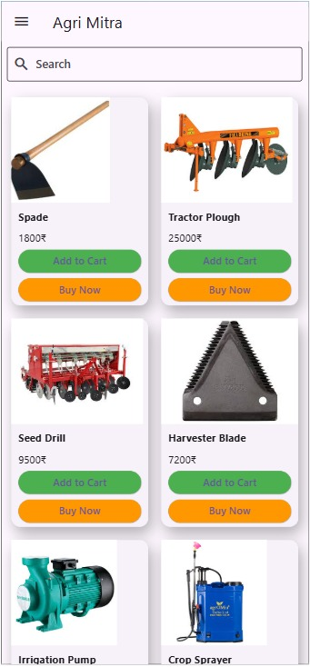

# 🌾 AgriMitra

AgriMitra is a user-friendly **E-commerce platform** tailored for **farmers**, offering access to a wide range of farming tools, fertilizers, pesticides, and more — all in one place. It also features an **interactive Learning Section** to empower farmers with the latest agricultural technologies.

---

## 📱 Preview

<!-- Example:

-->

---

## 🚀 Features

- ✅ Wide range of farming tools at **minimum cost** from suppliers.
- 📦 **On-time delivery** of ordered items.
- 📚 **Learning Section** for educating farmers about the latest farming technologies.
- 🖥️ **User-friendly interface** with smooth navigation.
- 🔐 **Secure payments** and **doorstep delivery**.

---

## 💡 Benefits for Farmers

- Access everything in one place — tools, products, and information.
- Stay updated on the **latest tech in agriculture**.
- Increase crop **productivity and yield** using the right tools.
- Save time with **easy online purchasing**.

---

## 🛠 Tech Stack

| Component       | Technology Used      |
|----------------|----------------------|
| Frontend        | Flutter               |
| Database        | SQL                  |
| APIs Integrated | - Google Maps API  
                  - Razorpay API  
                  - OpenWeatherMap API  
                  - **AgriBuddy API**: Crop advisory, market linkages, and financial services |

---

## 📌 Project Status

> 🔧 Currently, **only the frontend** is available. Backend development and integration are in progress.

---

## 🔭 Future Scope

- ✅ Full backend integration with APIs.
- 📈 Farmer dashboard with crop analysis and earnings tracking.
- 🧠 AI-based crop recommendation system.
- 🔔 Notification system for weather alerts, subsidies, and tech news.
- 🌐 Multi-language support for better accessibility.
- 🤝 Community forum for farmers.

---

## 🤝 Contributing

Pull requests are welcome. For major changes, please open an issue first to discuss what you would like to change.

---

## 📄 License

This project is licensed under the Proprietary License.

Terms:
You may use the code solely for personal or internal business purposes.

You may not modify, distribute, or create derivative works based on this code without explicit permission.

Redistribution, sublicensing, or leasing the software is not permitted.

For any other usage or permissions, please contact the author at [karankatakdhond@gmail.com].
---

## 🙌 Acknowledgements

- APIs by [AgriBuddy](https://agribuddy.com)
- Payment gateway by [Razorpay](https://razorpay.com)
- Weather data from [OpenWeatherMap](https://openweathermap.org)

---

